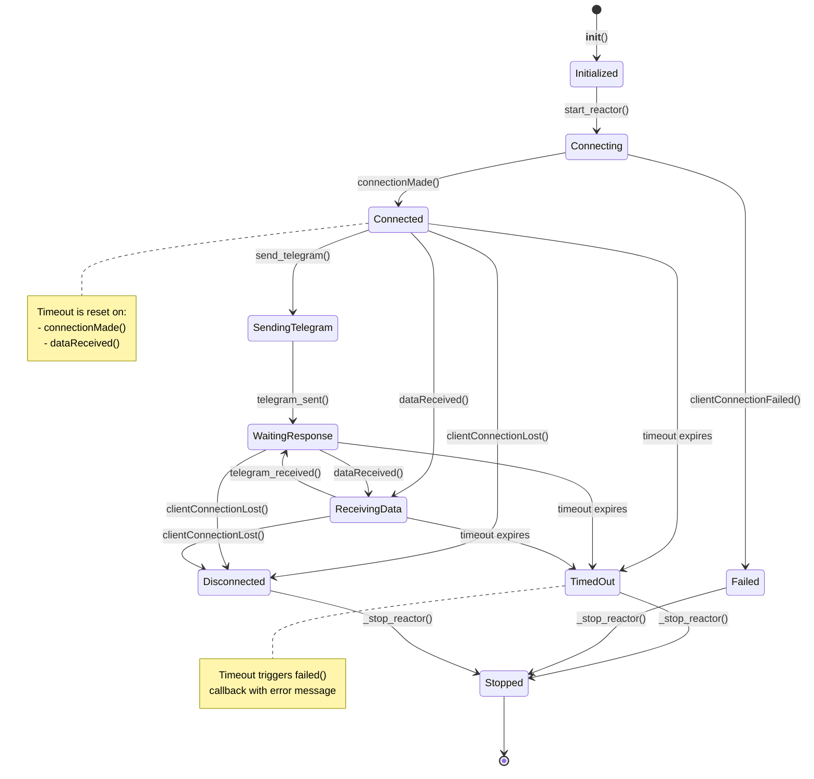
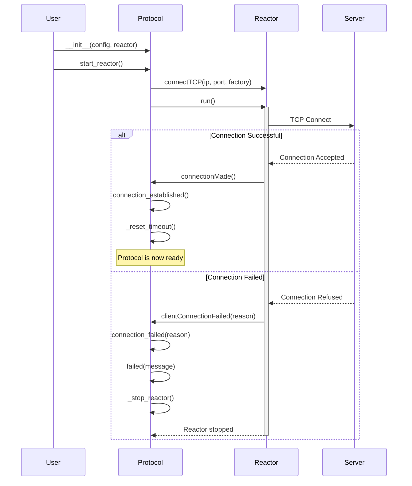
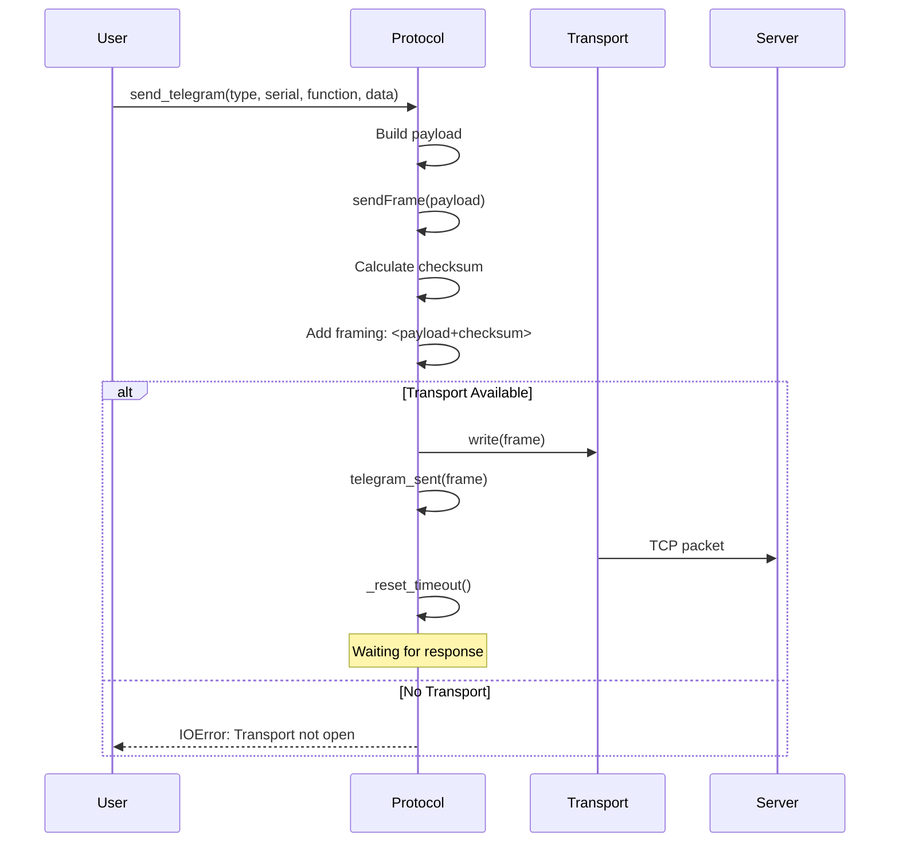
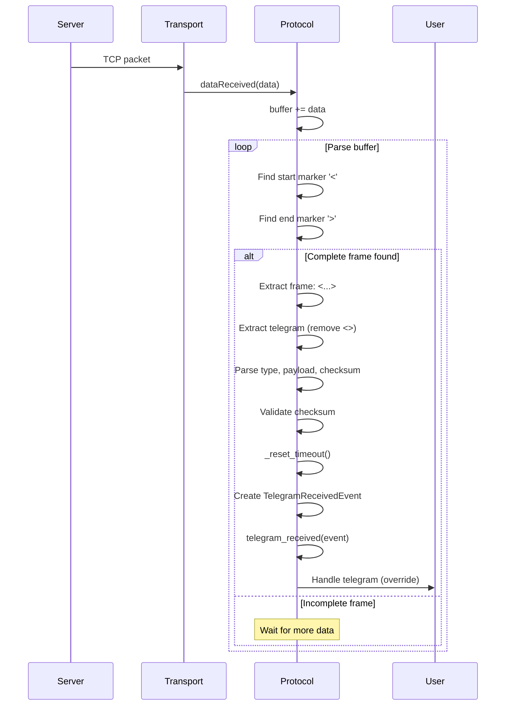
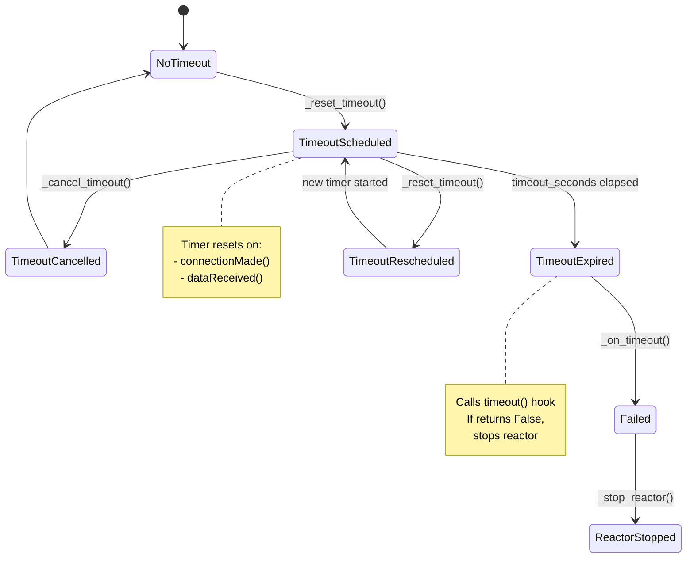

# ConbusProtocol Documentation

## Overview

`ConbusProtocol` is a Twisted-based protocol implementation for XP telegram communication over TCP. It combines both Protocol and ClientFactory interfaces to manage connection lifecycle, telegram transmission/reception, and timeout handling.

**File Location:** `src/xp/services/protocol/conbus_protocol.py`

## Architecture

The protocol is built on:
- **Twisted Protocol** - Handles data transmission and reception
- **Twisted ClientFactory** - Manages client connection lifecycle
- **Event-driven design** - Override hook methods to handle protocol events
- **Timeout management** - Automatic inactivity detection and cleanup

## Protocol State Machine



## Connection Lifecycle



## Telegram Send Flow



## Telegram Receive Flow



## Timeout Mechanism



## Event Hooks (Override Methods)

These methods are designed to be overridden in subclasses:

### telegram_sent(telegram_sent: str)
Called when a telegram frame has been successfully sent.

**Parameters:**
- `telegram_sent`: The complete frame sent (e.g., `<S0123450001F02D12FK>`)

**Use cases:**
- Log sent telegrams
- Track request/response correlation
- Update UI state

### telegram_received(telegram_received: TelegramReceivedEvent)
Called when a complete telegram frame has been received and parsed.

**Parameters:**
- `telegram_received`: Event containing:
  - `protocol`: Reference to protocol instance
  - `frame`: Complete frame with brackets
  - `telegram`: Frame without brackets
  - `payload`: Telegram without checksum
  - `telegram_type`: Type indicator (S/R/E)
  - `serial_number`: Device serial (for S/R types)
  - `checksum`: Received checksum
  - `checksum_valid`: Boolean validation result

**Use cases:**
- Process responses
- Handle events
- Update application state

### connection_established()
Called when TCP connection is successfully established.

**Use cases:**
- Send initial telegrams
- Initialize protocol state
- Log connection success

### connection_lost(reason: Failure)
Called when an established connection is lost.

**Parameters:**
- `reason`: Twisted Failure object with disconnection details

**Use cases:**
- Log disconnection
- Clean up resources
- Trigger reconnection logic

### failed(message: str)
Called when protocol encounters a fatal error.

**Parameters:**
- `message`: Error description

**Triggered by:**
- Connection failure
- Timeout expiration
- Custom error conditions

**Use cases:**
- Error logging
- Notify user/application
- Clean up resources

### timeout() -> bool
Called when inactivity timeout expires.

**Returns:**
- `True`: Continue operation (keep reactor running)
- `False`: Stop reactor (default behavior)

**Use cases:**
- Implement custom timeout handling
- Send keep-alive telegrams
- Decide whether to retry

## Public API Methods

### \_\_init\_\_(cli_config: ConbusClientConfig, reactor: PosixReactorBase)
Initialize the protocol.

**Parameters:**
- `cli_config`: Configuration containing IP, port, timeout
- `reactor`: Twisted reactor instance

### start_reactor()
Connect to the TCP server and start the event loop.

**Behavior:**
1. Connects to configured IP:port
2. Starts reactor (blocks until stopped)

**Usage:**
```python
protocol.start_reactor()  # Blocks until connection closes
```

### send_telegram(telegram_type, serial_number, system_function, data_value)
Send a formatted telegram.

**Parameters:**
- `telegram_type`: TelegramType enum (SYSTEM, REPLY, etc.)
- `serial_number`: 10-character device serial
- `system_function`: SystemFunction enum
- `data_value`: Data payload string

**Example:**
```python
protocol.send_telegram(
    telegram_type=TelegramType.SYSTEM,
    serial_number="0123450001",
    system_function=SystemFunction.BLINK,
    data_value="00"
)
```

**Frame format:** `<{type}{serial}F{function}D{data}{checksum}>`

### sendFrame(data: bytes)
Low-level method to send raw telegram payload.

**Parameters:**
- `data`: Raw payload bytes (without checksum or framing)

**Behavior:**
1. Calculates checksum
2. Adds framing brackets
3. Sends via transport

**Raises:**
- `IOError`: If transport is not available

## Context Manager Support

Protocol can be used as a context manager for automatic cleanup:

```python
with ConbusProtocol(config, reactor) as protocol:
    protocol.start_reactor()
# Reactor automatically stopped on exit
```

## Telegram Frame Format

```
┌────────────────────────────────────────────────┐
│            Complete Frame Structure            │
├────────────────────────────────────────────────┤
│  <S0123450001F02D12FK>                         │
│  ││├────────┘├─┘├─┘├┘│                         │
│  │││         │  │  │ │                         │
│  │││         │  │  │ └── Frame markers         │
│  │││         │  │  └──── Checksum (2 chars)    │
│  │││         │  └─────── Data value            │
│  │││         └────────── System function       │
│  ││└──────────────────── Serial number (10)    │
│  │└───────────────────── Telegram type         │
│  └────────────────────── Frame markers         │
└────────────────────────────────────────────────┘

Types:
  S = System telegram
  R = Reply telegram
  E = Event telegram
  O = Old event telegram
```

## Complete Usage Example

```python
from twisted.internet import reactor
from xp.models import ConbusClientConfig
from xp.services.protocol import ConbusProtocol
from xp.models.telegram.system_function import SystemFunction
from xp.models.telegram.telegram_type import TelegramType

class MyProtocol(ConbusProtocol):
    def connection_established(self):
        print("Connected! Sending blink command...")
        self.send_telegram(
            telegram_type=TelegramType.SYSTEM,
            serial_number="0123450001",
            system_function=SystemFunction.BLINK,
            data_value="00"
        )

    def telegram_sent(self, telegram_sent: str):
        print(f"Sent: {telegram_sent}")

    def telegram_received(self, event):
        print(f"Received: {event.frame}")
        print(f"Valid: {event.checksum_valid}")

        if event.telegram_type == "R":
            print("Got response, stopping...")
            self._stop_reactor()

    def failed(self, message: str):
        print(f"Failed: {message}")

    def timeout(self) -> bool:
        print("Timeout occurred")
        return False  # Stop reactor

# Configuration
config = ConbusClientConfig(
    conbus={
        'ip': '192.168.1.100',
        'port': 10001,
        'timeout': 5.0
    }
)

# Run protocol
protocol = MyProtocol(config, reactor)
protocol.start_reactor()  # Blocks until stopped
```

## Integration Example (ConbusBlinkService)

See `src/xp/services/conbus/conbus_blink_service.py:52-109` for a real-world implementation that:

1. Extends ConbusProtocol
2. Sends blink/unblink commands on connection
3. Processes reply telegrams
4. Uses callback pattern for async results
5. Implements comprehensive error handling

## Error Handling

### Connection Errors
- **clientConnectionFailed**: Called before connection established
- **clientConnectionLost**: Called after connection was established
- Both trigger `failed()` and reactor cleanup

### Timeout Errors
- Configurable via `cli_config.timeout`
- Automatically resets on activity
- Triggers `timeout()` then `failed()`

### Protocol Errors
- Invalid checksum: Logged but still dispatched to `telegram_received()`
- Missing transport: Raises `IOError` on `sendFrame()`

## Configuration

Required in `ConbusClientConfig`:
```python
{
    'conbus': {
        'ip': str,        # Server IP address
        'port': int,      # Server port
        'timeout': float  # Inactivity timeout (seconds)
    }
}
```

## Thread Safety

- Protocol runs in Twisted reactor thread
- All callbacks execute in reactor thread
- Use `reactor.callFromThread()` for external thread interaction

## Best Practices

1. **Always override event hooks** - Don't modify base class
2. **Handle both success and failure** - Implement `failed()` callback
3. **Manage timeout appropriately** - Reset if expecting more data
4. **Validate checksums** - Check `checksum_valid` before processing
5. **Clean up resources** - Use context manager or explicit cleanup
6. **Log appropriately** - Use provided logger instance
7. **Test timeout scenarios** - Ensure timeout handler works correctly

## Related Models

- `TelegramReceivedEvent` - src/xp/models/protocol/conbus_protocol.py:186
- `ConbusClientConfig` - Configuration model
- `TelegramType` - Telegram type enumeration
- `SystemFunction` - System function codes

## See Also

- Twisted Protocol documentation
- Telegram frame format specification
- ConbusBlinkService implementation example
