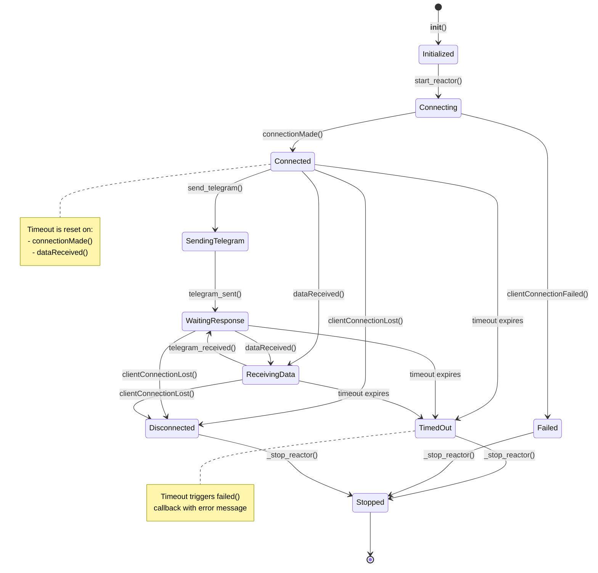
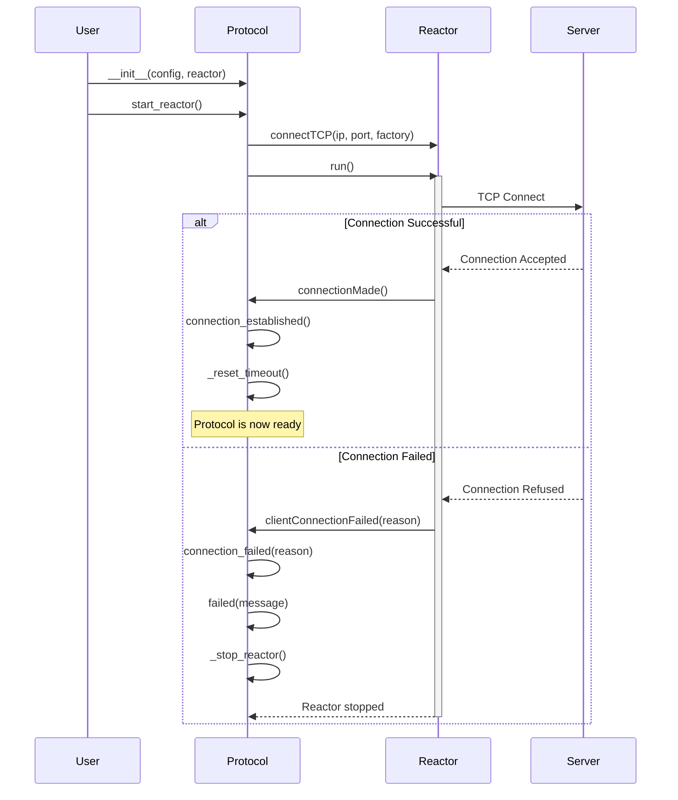
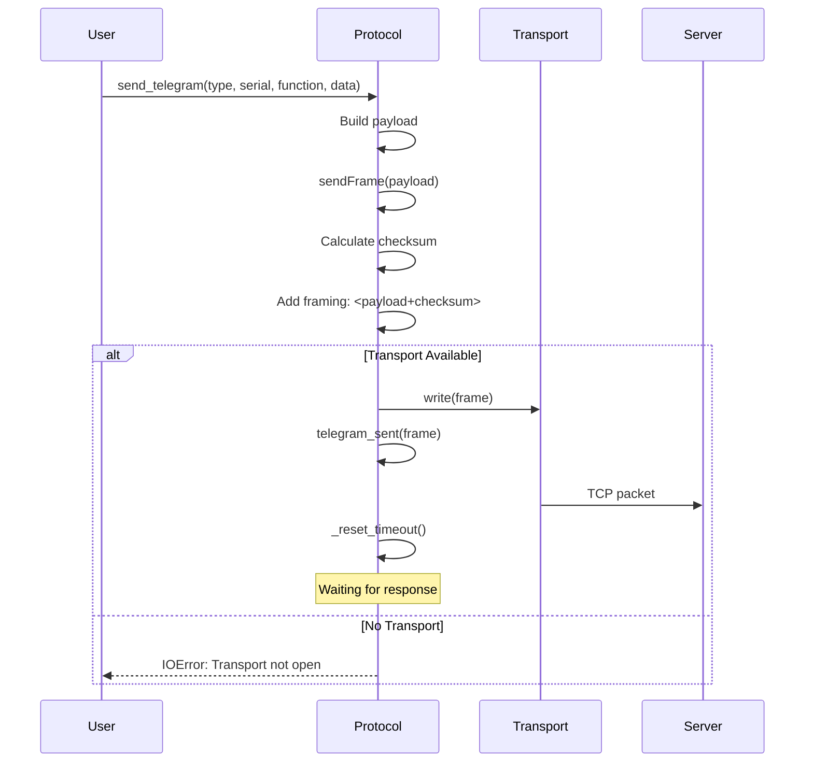
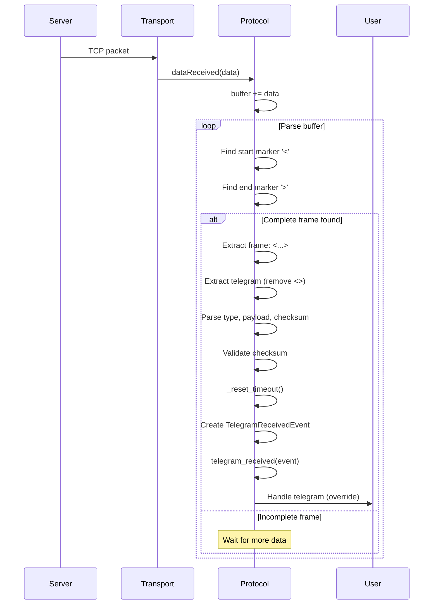
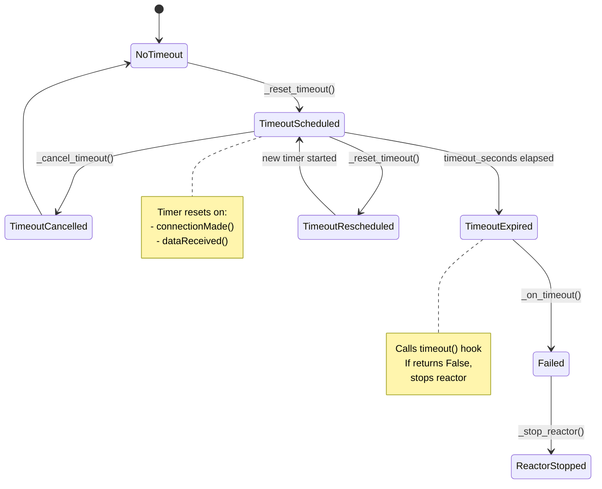

# ConbusEventProtocol Documentation

## Overview

`ConbusEventProtocol` is a Twisted-based protocol implementation for XP telegram communication over TCP. It combines both Protocol and ClientFactory interfaces to manage connection lifecycle, telegram transmission/reception, and timeout handling using a signal-based event system.

**File Location:** `src/xp/services/protocol/conbus_event_protocol.py`

## Architecture

The protocol is built on:
- **Twisted Protocol** - Handles data transmission and reception
- **Twisted ClientFactory** - Manages client connection lifecycle
- **Signal-based design** - Uses psygnal signals for event notification
- **Composition pattern** - Services compose protocol instead of inheriting
- **Timeout management** - Automatic inactivity detection and cleanup
- **Queue-based telegram sending** - FIFO queue with randomized delays between sends

## Protocol State Machine



## Connection Lifecycle



## Telegram Send Flow



## Telegram Receive Flow



## Timeout Mechanism



## Signal-Based Events

The protocol uses psygnal signals for event notification. Services connect to these signals instead of overriding methods.

### Available Signals

#### on_connection_made: Signal()
Emitted when TCP connection is successfully established.

**Signature:** `() -> None`

**Use cases:**
- Send initial telegrams
- Initialize service state
- Log connection success

**Example:**
```python
protocol.on_connection_made.connect(self.connection_made)
```

#### on_telegram_sent: Signal(bytes)
Emitted when a telegram frame has been successfully sent.

**Signature:** `(str) -> None`

**Parameters:**
- `telegram_sent`: The complete frame sent as string (e.g., `<S0123450001F02D12FK>`)

**Use cases:**
- Log sent telegrams
- Track request/response correlation
- Update UI state

**Example:**
```python
protocol.on_telegram_sent.connect(self.telegram_sent)
```

#### on_telegram_received: Signal(TelegramReceivedEvent)
Emitted when a complete telegram frame has been received and parsed.

**Signature:** `(TelegramReceivedEvent) -> None`

**Parameters:**
- `telegram_received`: Event containing:
  - `protocol`: Reference to protocol instance
  - `frame`: Complete frame with brackets
  - `telegram`: Frame without brackets
  - `payload`: Telegram without checksum
  - `telegram_type`: Type indicator (S/R/E)
  - `serial_number`: Device serial (for S/R types)
  - `checksum`: Received checksum
  - `checksum_valid`: Boolean validation result

**Use cases:**
- Process responses
- Handle events
- Update application state

**Example:**
```python
protocol.on_telegram_received.connect(self.telegram_received)
```

#### on_timeout: Signal()
Emitted when inactivity timeout expires.

**Signature:** `() -> None`

**Use cases:**
- Implement custom timeout handling
- Log timeout events
- Update error state

**Note:** Protocol automatically stops reactor after timeout signal.

**Example:**
```python
protocol.on_timeout.connect(self.timeout)
```

#### on_failed: Signal(str)
Emitted when protocol encounters a fatal error.

**Signature:** `(str) -> None`

**Parameters:**
- `message`: Error description

**Triggered by:**
- Connection failure
- Timeout expiration
- Custom error conditions

**Use cases:**
- Error logging
- Notify user/application
- Clean up resources

**Example:**
```python
protocol.on_failed.connect(self.failed)
```

#### on_connection_lost: Signal(Failure)
Emitted when an established connection is lost.

**Signature:** `(Failure) -> None`

**Parameters:**
- `reason`: Twisted Failure object with disconnection details

**Use cases:**
- Log disconnection
- Clean up resources
- Trigger reconnection logic

**Example:**
```python
protocol.on_connection_lost.connect(self.connection_lost)
```

#### on_connection_failed: Signal(Failure)
Emitted when connection attempt fails.

**Signature:** `(Failure) -> None`

**Parameters:**
- `reason`: Twisted Failure object with failure details

**Example:**
```python
protocol.on_connection_failed.connect(self.connection_failed)
```

#### on_data_received: Signal(bytes)
Emitted when raw data is received from the connection.

**Signature:** `(bytes) -> None`

**Parameters:**
- `data`: Raw bytes received

**Example:**
```python
protocol.on_data_received.connect(self.data_received)
```

#### on_send_frame: Signal(bytes)
Emitted before a frame is sent.

**Signature:** `(bytes) -> None`

**Parameters:**
- `data`: Raw telegram payload (without checksum/framing)

**Example:**
```python
protocol.on_send_frame.connect(self.send_frame)
```

## Public API Methods

### \_\_init\_\_(cli_config: ConbusClientConfig, reactor: PosixReactorBase)
Initialize the protocol.

**Parameters:**
- `cli_config`: Configuration containing IP, port, timeout
- `reactor`: Twisted reactor instance

**Example:**
```python
from twisted.internet import reactor
from xp.models import ConbusClientConfig

config = ConbusClientConfig(conbus={'ip': '192.168.1.100', 'port': 10001, 'timeout': 5.0})
protocol = ConbusEventProtocol(config, reactor)
```

### connect()
Connect to the TCP server.

**Behavior:**
1. Auto-detects running asyncio event loop if present
2. Integrates with asyncio if available
3. Connects to configured IP:port via reactor

**Usage:**
```python
protocol.connect()  # Non-blocking
```

### disconnect()
Disconnect from the TCP server.

**Behavior:**
- Closes all active connections

**Usage:**
```python
protocol.disconnect()
```

### start_reactor()
Connect to the TCP server and start the event loop.

**Behavior:**
1. Calls `connect()` to establish TCP connection
2. Starts reactor (blocks until stopped)
3. Auto-integrates with asyncio if event loop detected

**Usage:**
```python
protocol.start_reactor()  # Blocks until reactor stops
```

### stop_reactor()
Stop the reactor if it's running.

**Behavior:**
- Safely stops reactor even if already stopped
- Handles edge cases where reactor wasn't started via run()

**Usage:**
```python
protocol.stop_reactor()
```

### send_telegram(telegram_type, serial_number, system_function, data_value)
Send a formatted telegram.

**Parameters:**
- `telegram_type`: TelegramType enum (SYSTEM, REPLY, etc.)
- `serial_number`: 10-character device serial
- `system_function`: SystemFunction enum
- `data_value`: Data payload string

**Behavior:**
- Adds telegram to FIFO queue
- Starts queue manager if not running
- Sends with randomized delays (10-80ms) between telegrams

**Example:**
```python
protocol.send_telegram(
    telegram_type=TelegramType.SYSTEM,
    serial_number="0123450001",
    system_function=SystemFunction.BLINK,
    data_value="00"
)
```

**Frame format:** `<{type}{serial}F{function}D{data}{checksum}>`

### send_event_telegram(module_type_code, link_number, input_number)
Send an event telegram.

**Parameters:**
- `module_type_code`: ModuleTypeCode enum
- `link_number`: Link number (0-99)
- `input_number`: Input number (0-99)

**Example:**
```python
protocol.send_event_telegram(
    module_type_code=ModuleTypeCode.XP12,
    link_number=1,
    input_number=8
)
```

**Frame format:** `<E{module_type}L{link:02d}I{input:02d}{checksum}>`

### send_raw_telegram(payload: str)
Send a raw telegram payload.

**Parameters:**
- `payload`: Raw telegram string (without checksum or framing)

**Behavior:**
- Adds to queue and sends with randomized delay
- Automatically calculates checksum and adds framing

**Example:**
```python
protocol.send_raw_telegram("S0123450001F02D12")
```

### sendFrame(data: bytes)
Low-level method to send raw telegram payload.

**Parameters:**
- `data`: Raw payload bytes (without checksum or framing)

**Behavior:**
1. Emits `on_send_frame` signal
2. Calculates checksum
3. Adds framing brackets
4. Sends via transport
5. Emits `on_telegram_sent` signal
6. Resets timeout

**Note:** Usually called by queue manager, not directly

### set_event_loop(event_loop: asyncio.AbstractEventLoop)
Integrate protocol with an asyncio event loop.

**Parameters:**
- `event_loop`: asyncio event loop instance

**Behavior:**
- Sets reactor to use specified event loop
- Sets reactor to running state if not already

**Usage:**
```python
import asyncio
event_loop = asyncio.get_event_loop()
protocol.set_event_loop(event_loop)
```

### call_later(delay, callable_action, *args, **kw) -> DelayedCall
Schedule a callable to be executed later.

**Parameters:**
- `delay`: Delay in seconds
- `callable_action`: Function to call
- `args`: Positional arguments
- `kw`: Keyword arguments

**Returns:**
- DelayedCall object (can be cancelled)

**Example:**
```python
delayed_call = protocol.call_later(1.0, my_function, arg1, arg2)
delayed_call.cancel()  # Cancel if needed
```

## Context Manager Support

Protocol can be used as a context manager for automatic cleanup:

```python
with ConbusEventProtocol(config, reactor) as protocol:
    protocol.start_reactor()
# Reactor automatically stopped on exit
```

## Queue-Based Telegram Sending

ConbusEventProtocol implements a FIFO queue system for sending telegrams with automatic spacing:

### How It Works

1. **Queueing**: When you call `send_telegram()`, `send_event_telegram()`, or `send_raw_telegram()`, the telegram is added to a FIFO queue
2. **Queue Manager**: The queue manager automatically starts and processes telegrams sequentially
3. **Randomized Delays**: Between each telegram send, a random delay of 10-80ms is applied to prevent overwhelming the receiver
4. **Thread-Safe**: Queue operations are protected by a lock for thread safety

### Benefits

- **Prevents telegram flooding** - Automatic spacing between sends
- **Maintains order** - FIFO ensures telegrams are sent in the order they were queued
- **Non-blocking** - Queue operations return immediately
- **Automatic** - Queue manager starts/stops automatically

### Example

```python
# Queue multiple telegrams - they'll be sent with automatic spacing
protocol.send_telegram(TelegramType.SYSTEM, "0123450001", SystemFunction.BLINK, "01")
protocol.send_telegram(TelegramType.SYSTEM, "0123450002", SystemFunction.BLINK, "01")
protocol.send_telegram(TelegramType.SYSTEM, "0123450003", SystemFunction.BLINK, "01")

# All three will be sent sequentially with 10-80ms delays between them
```

## Telegram Frame Format

```
┌────────────────────────────────────────────────┐
│            Complete Frame Structure            │
├────────────────────────────────────────────────┤
│  <S0123450001F02D12FK>                         │
│  ││├────────┘├─┘├─┘├┘│                         │
│  │││         │  │  │ │                         │
│  │││         │  │  │ └── Frame markers         │
│  │││         │  │  └──── Checksum (2 chars)    │
│  │││         │  └─────── Data value            │
│  │││         └────────── System function       │
│  ││└──────────────────── Serial number (10)    │
│  │└───────────────────── Telegram type         │
│  └────────────────────── Frame markers         │
└────────────────────────────────────────────────┘

Types:
  S = System telegram
  R = Reply telegram
  E = Event telegram
  O = Old event telegram
```

## Complete Usage Example

### Composition Pattern (Recommended)

Services compose the protocol instead of inheriting from it:

```python
from twisted.internet import reactor
from xp.models import ConbusClientConfig
from xp.services.protocol import ConbusEventProtocol
from xp.models.protocol.conbus_protocol import TelegramReceivedEvent
from xp.models.telegram.system_function import SystemFunction
from xp.models.telegram.telegram_type import TelegramType

class MyService:
    def __init__(self, conbus_protocol: ConbusEventProtocol):
        self.conbus_protocol = conbus_protocol

        # Connect to protocol signals
        self.conbus_protocol.on_connection_made.connect(self.connection_made)
        self.conbus_protocol.on_telegram_sent.connect(self.telegram_sent)
        self.conbus_protocol.on_telegram_received.connect(self.telegram_received)
        self.conbus_protocol.on_timeout.connect(self.timeout)
        self.conbus_protocol.on_failed.connect(self.failed)

    def connection_made(self) -> None:
        print("Connected! Sending blink command...")
        self.conbus_protocol.send_telegram(
            telegram_type=TelegramType.SYSTEM,
            serial_number="0123450001",
            system_function=SystemFunction.BLINK,
            data_value="00"
        )

    def telegram_sent(self, telegram_sent: str) -> None:
        print(f"Sent: {telegram_sent}")

    def telegram_received(self, event: TelegramReceivedEvent) -> None:
        print(f"Received: {event.frame}")
        print(f"Valid: {event.checksum_valid}")

        if event.telegram_type == "R":
            print("Got response, stopping...")
            self.stop_reactor()

    def failed(self, message: str) -> None:
        print(f"Failed: {message}")

    def timeout(self) -> None:
        print("Timeout occurred")
        # Protocol automatically stops reactor

    def start_reactor(self) -> None:
        self.conbus_protocol.start_reactor()

    def stop_reactor(self) -> None:
        self.conbus_protocol.stop_reactor()

    def __enter__(self) -> "MyService":
        return self

    def __exit__(self, _exc_type, _exc_val, _exc_tb) -> None:
        # Disconnect all signals
        self.conbus_protocol.on_connection_made.disconnect(self.connection_made)
        self.conbus_protocol.on_telegram_sent.disconnect(self.telegram_sent)
        self.conbus_protocol.on_telegram_received.disconnect(self.telegram_received)
        self.conbus_protocol.on_timeout.disconnect(self.timeout)
        self.conbus_protocol.on_failed.disconnect(self.failed)
        self.stop_reactor()

# Configuration
config = ConbusClientConfig(
    conbus={
        'ip': '192.168.1.100',
        'port': 10001,
        'timeout': 5.0
    }
)

# Create protocol and service
protocol = ConbusEventProtocol(config, reactor)
service = MyService(protocol)

# Run service
with service:
    service.start_reactor()  # Blocks until stopped
```

### Direct Protocol Usage

For simple use cases, you can connect directly to protocol signals:

```python
from twisted.internet import reactor
from xp.models import ConbusClientConfig
from xp.services.protocol import ConbusEventProtocol
from xp.models.telegram.system_function import SystemFunction
from xp.models.telegram.telegram_type import TelegramType

# Configuration
config = ConbusClientConfig(
    conbus={
        'ip': '192.168.1.100',
        'port': 10001,
        'timeout': 5.0
    }
)

# Create protocol
protocol = ConbusEventProtocol(config, reactor)

# Define handlers
def on_connection_made() -> None:
    print("Connected!")
    protocol.send_telegram(
        telegram_type=TelegramType.SYSTEM,
        serial_number="0123450001",
        system_function=SystemFunction.BLINK,
        data_value="00"
    )

def on_telegram_received(event) -> None:
    print(f"Received: {event.frame}")
    if event.telegram_type == "R":
        protocol.stop_reactor()

def on_failed(message: str) -> None:
    print(f"Failed: {message}")

# Connect signals
protocol.on_connection_made.connect(on_connection_made)
protocol.on_telegram_received.connect(on_telegram_received)
protocol.on_failed.connect(on_failed)

# Run
with protocol:
    protocol.start_reactor()  # Blocks until stopped
```

## Integration Examples

### ConbusDiscoverService (Reference Implementation)

See `src/xp/services/conbus/conbus_discover_service.py:23` for the primary reference implementation that demonstrates:

1. Composition pattern with ConbusEventProtocol
2. Signal-based event handling
3. Context manager implementation
4. Service-specific signals (on_discover, on_device_found)
5. Proper signal connection/disconnection lifecycle
6. State management for singleton reuse

### ConbusReceiveService (Already Migrated)

See `src/xp/services/conbus/conbus_receive_service.py:18` for another complete example showing:

1. ConbusEventProtocol composition
2. Event telegram handling
3. Signal integration
4. Proper cleanup in `__exit__`

## Error Handling

### Connection Errors
- **clientConnectionFailed**: Called before connection established
- **clientConnectionLost**: Called after connection was established
- Both trigger `failed()` and reactor cleanup

### Timeout Errors
- Configurable via `cli_config.timeout`
- Automatically resets on activity
- Triggers `timeout()` then `failed()`

### Protocol Errors
- Invalid checksum: Logged but still dispatched to `telegram_received()`
- Missing transport: Raises `IOError` on `sendFrame()`

## Configuration

Required in `ConbusClientConfig`:
```python
{
    'conbus': {
        'ip': str,        # Server IP address
        'port': int,      # Server port
        'timeout': float  # Inactivity timeout (seconds)
    }
}
```

## Thread Safety

- Protocol runs in Twisted reactor thread
- All callbacks execute in reactor thread
- Use `reactor.callFromThread()` for external thread interaction

## Best Practices

1. **Use composition over inheritance** - Services should compose ConbusEventProtocol, not inherit from it
2. **Connect signals in `__init__`** - Connect to protocol signals once during initialization
3. **Disconnect signals in `__exit__`** - Always disconnect in context manager exit to prevent memory leaks
4. **Implement context manager** - All services must implement `__enter__` and `__exit__`
5. **Reset state in `__enter__`** - For singleton services, reset mutable state when entering context
6. **Handle both success and failure** - Connect to `on_failed` signal for error handling
7. **Validate checksums** - Check `checksum_valid` before processing telegrams
8. **Use timeout appropriately** - Set timeout via `protocol.timeout_seconds` before starting reactor
9. **Stop reactor in signal handlers** - Call `stop_reactor()` when operation completes (e.g., in on_finish)
10. **Test signal integration** - Mock protocol and verify signal connections in unit tests
11. **Log appropriately** - Use protocol's logger instance for debugging
12. **Don't return values from timeout** - New `timeout()` signature is `-> None`, not `-> bool`

## Key Differences from ConbusProtocol (Legacy)

The new `ConbusEventProtocol` uses a fundamentally different design pattern:

### Architecture

| Aspect | Old (ConbusProtocol) | New (ConbusEventProtocol) |
|--------|---------------------|---------------------------|
| **Pattern** | Inheritance | Composition |
| **Event Handling** | Override methods | Connect to signals |
| **Coupling** | Tight (services inherit) | Loose (dependency injection) |
| **Reusability** | One service per protocol instance | Multiple subscribers possible |
| **Testability** | Requires full reactor stack | Mock protocol interface |

### Method Signatures

| Method | Old Signature | New Signature |
|--------|--------------|---------------|
| **connection_established** | `connection_established()` | Signal: `on_connection_made.emit()` |
| **telegram_sent** | `telegram_sent(str)` | Signal: `on_telegram_sent.emit(str)` |
| **telegram_received** | `telegram_received(event)` | Signal: `on_telegram_received.emit(event)` |
| **timeout** | `timeout() -> bool` | Signal: `on_timeout.emit()` (returns None) |
| **failed** | `failed(str)` | Signal: `on_failed.emit(str)` |

### Lifecycle Management

| Aspect | Old Pattern | New Pattern |
|--------|-------------|-------------|
| **Service creation** | `Service(config, reactor)` | `Service(protocol)` |
| **Signal setup** | Override methods in class | Connect in `__init__` |
| **Signal cleanup** | Inherited cleanup | Disconnect in `__exit__` |
| **Reactor control** | Service calls `start_reactor()` | Caller controls lifecycle |
| **Timeout behavior** | Return `False` to stop | Protocol stops automatically |

### Migration Path

Services using the old `ConbusProtocol` should migrate to `ConbusEventProtocol`. See `doc/protocol/Feat-ConbusEventProtocol-Migration.md` for detailed migration guide.

## Related Models

- `TelegramReceivedEvent` - src/xp/models/protocol/conbus_protocol.py:186
- `ConbusClientConfig` - Configuration model
- `TelegramType` - Telegram type enumeration
- `SystemFunction` - System function codes
- `ModuleTypeCode` - Module type enumeration

## See Also

- **Migration Guide**: doc/protocol/Feat-ConbusEventProtocol-Migration.md
- **Reference Implementation**: src/xp/services/conbus/conbus_discover_service.py:23
- **Protocol Source**: src/xp/services/protocol/conbus_event_protocol.py
- **Twisted Protocol Documentation**: https://docs.twistedmatrix.com/en/stable/core/howto/servers.html
- **psygnal Signals**: https://psygnal.readthedocs.io/
